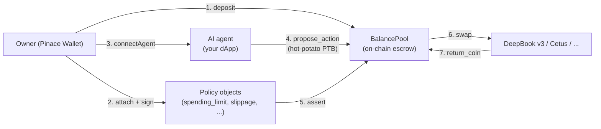

Pinace is a non-custodial wallet that lets AI agents act on a user's
funds **without ever holding their keys**. The owner deposits into an
on-chain `BalancePool`, attaches one or more policies (spending limits,
slippage caps, time windows), and any wallet-standard dApp can drive
an agent that swaps inside those exact bounds.

| Layer | Package | Notes |
| --- | --- | --- |
| **Wallet** | [`pinace-wallet/frontend`](https://github.com/pinace-wallet/frontend) | Chrome / Brave / Edge MV3 extension. Owner UI + agent sign approvals. |
| **SDK** | [`@pinace/core`](https://www.npmjs.com/package/@pinace/core) | TypeScript PTB builders for pools, policies, agents, and the `propose_action → settle` hot-potato. |
| **Indexer** | Pinace Indexer (REST + SSE) | Real-time read API for agents, pools, actions, policies. |
| **Contracts** | Pinace Move package on Sui | `balance_pool`, `delegation`, policy modules. Testnet today, mainnet next. |

<Callout type="info">
  **Where we are today.** Live on **Sui testnet** with **DeepBook v3**
  as the first integrated venue. Cetus, Scallop, Aftermath, NAVI and
  more are on the roadmap — see [Integrations](/docs/integrations).
</Callout>

<Cards>
  <Card title="Quickstart" href="/docs/quickstart" description="From zero to your first agent swap in 5 minutes." />
  <Card title="Concepts" href="/docs/concepts" description="BalancePool, policies, agent keys, hot-potato PTB." />
  <Card title="SDK reference" href="/docs/sdk" description="Every export of @pinace/core with copy-paste examples." />
  <Card title="Integrations" href="/docs/integrations" description="Sui venues you can build agents on top of." />
</Cards>

## How it fits together

Every step is a verifiable on-chain transaction. The agent never holds
the owner's key. Policies are checked inside the **same** PTB as the
swap — if anything breaks (spending limit, wrong coin, slippage), the
whole transaction reverts.

## Two ways to integrate

**You're building an agent or chat app** → start with [Quickstart](/docs/quickstart)
and the [Wallet Standard features](/docs/wallet) `pinace:connectAgent`
+ `pinace:signAndExecuteAsAgent`. Two RPCs and dapp-kit gives you
everything else.

**You're a venue (DEX, lending, yield)** → read [Adding a venue](/docs/integrations#adding-a-venue)
and the [PTB action shape](/docs/sdk). Your team writes a Move
action handler; Pinace gates it with the user's existing policies.
