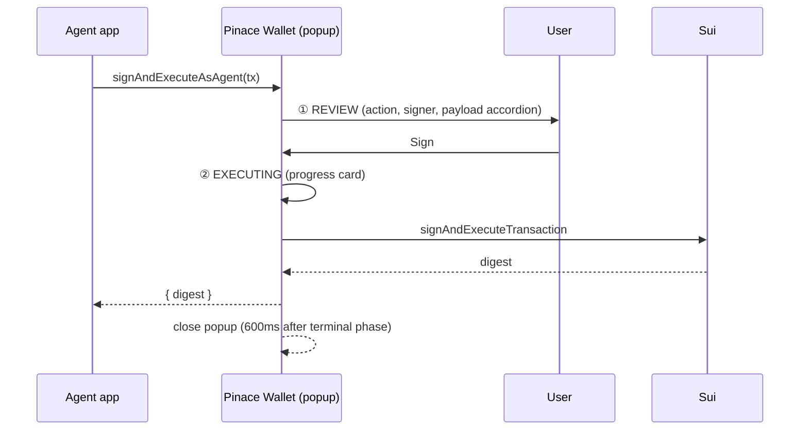

Every state-mutating call into Pinace Wallet opens an approval popup
(Slush / Phantom semantics). Same chrome across owner ops and
agent ops; copy + buttons swap by request type.

## Two phases



### ① Review

- Eyebrow + bold title pick by request type: **Sign transaction** /
  **Sign message** / **Connect agent**.
- Origin card with avatar + URL + Connected/Unverified tag.
- Details panel: action kind, signer (short addr + tooltip),
  collapsible raw payload.
- Reject (outline) + Sign (brand-blue gradient) buttons.

### ② Executing (only for `sign_transaction`)

- Popup **does not close** when the user clicks Sign — it transitions
  to the execution view.
- Progress card: `Running` pill (amber), `0/3 → 1/3 → 2/3 → 3/3`
  counter, milestones (`Sign → Broadcast → Finalise`).
- Stop pill: black bg + red gradient stop button. Click = wallet
  races the tx pipeline against the abort signal. If abort wins, the
  wallet throws `Error: User aborted execution` to the agent app
  (the on-chain tx may still land — wallet can't cancel a submitted
  tx).
- On terminal state: pill flips to green `Done` or red `Stopped`,
  600ms hold, popup closes.

## What the agent app should handle

The Wallet Standard call rejects in three cases. Pinace ships
constants on the agent SDK; the catch block in plain JS:

```ts
try {
  const { digest } = await features['pinace:signAndExecuteAsAgent']
    .signAndExecute({ transaction });
  // success
} catch (err) {
  const msg = (err as Error).message ?? '';
  if (msg.includes('User aborted execution')) {
    // user clicked Stop mid-flight — tell them the tx may still have landed
  } else if (msg.toLowerCase().includes('reject')) {
    // user rejected before signing
  } else {
    // real failure (gas, abort code, network)
  }
}
```

Fenik's chat shows different copy for each branch:
- `aborted_by_user` → *"Got it — I stopped the swap. The on-chain
  tx may still have landed; check your wallet for the final state."*
- `rejected_by_user` → *"Swap cancelled."*
- `error` → surface the Move abort code or RPC error verbatim.

## Why no second confirm for owner ops

Deposit / withdraw / attach policy / revoke agent all go through
the same approval popup. Type-to-confirm dialogs (revoke agent,
remove policy) act as the strong-intent step; the popup is the
sign-step. We deliberately don't double up.
